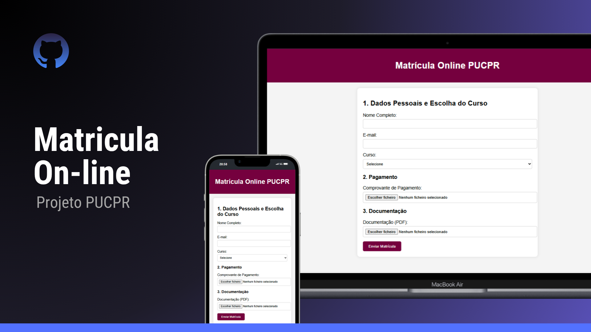

<h1 align="center"> Matricula On-line </h1>
<h2 align="centrer"> Projeto Matricula Online - PUCPR </h2>

  <a href="#-tecnologias">Tecnologias</a>&nbsp;&nbsp;&nbsp;|&nbsp;&nbsp;&nbsp;
  <a href="#-projeto">Projeto</a>&nbsp;&nbsp;&nbsp;|&nbsp;&nbsp;&nbsp;
  <a href="#memo-licença">Licença</a>

  

 

  

## 🚀 Tecnologias

Esse projeto foi desenvolvido com as seguintes tecnologias:

- HTML e CSS
- JavaScript
- Github

## 💻 Projeto

- [Acesse o projeto finalizado (online)](https://silverioesantos.github.io/matricula-online/)

## :memo: Licença

Esse projeto está sob a licença MIT.
